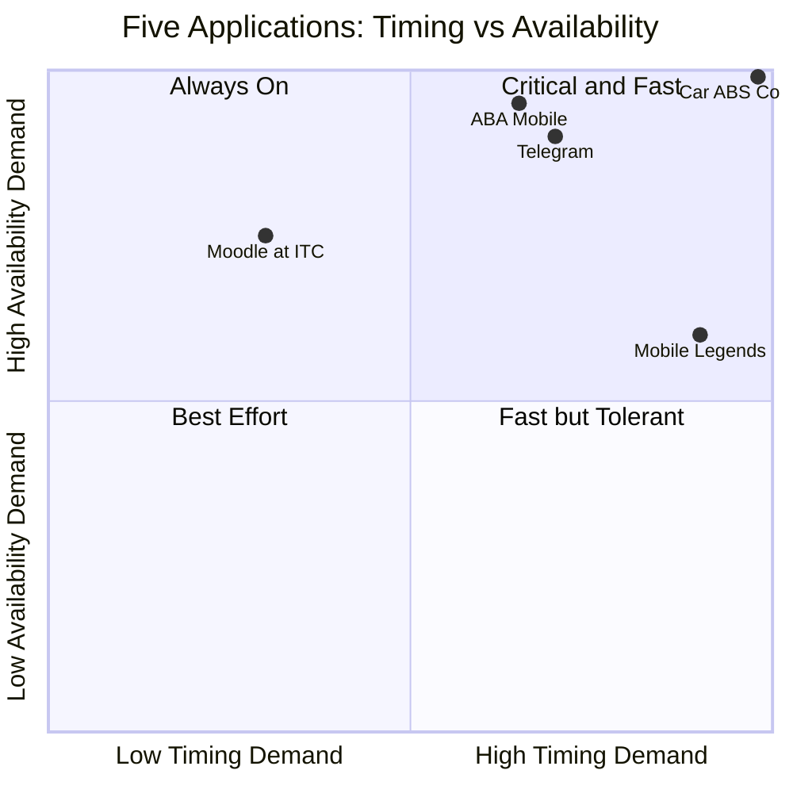

## Application Quadrant Chart

```mermaid
quadrantChart
    title Five Applications: Timing vs Availability
    x-axis Low Timing Demand --> High Timing Demand
    y-axis Low Availability Demand --> High Availability Demand
    quadrant-1 Critical and Fast
    quadrant-2 Always On
    quadrant-3 Best Effort
    quadrant-4 Fast but Tolerant
    Moodle at ITC: [0.30, 0.75]
    ABA Mobile: [0.65, 0.95]
    Telegram: [0.70, 0.90]
    Mobile Legends: [0.90, 0.60]
    Car ABS Controller: [0.98, 0.99]
```
